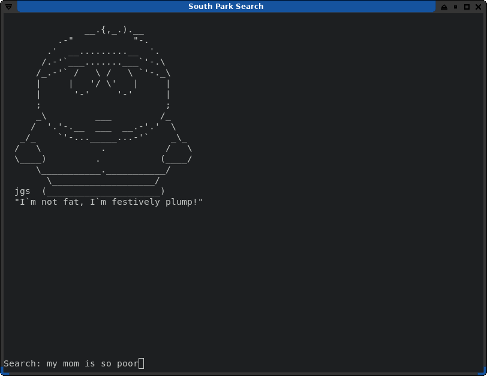
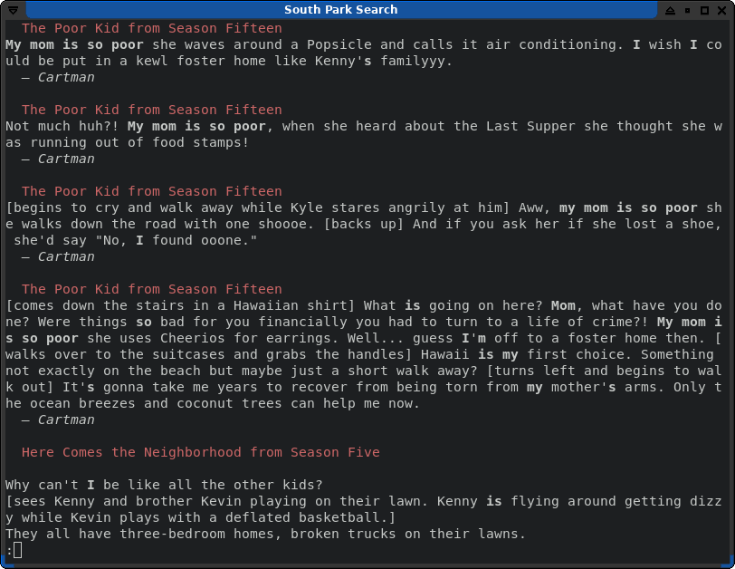

# South Park Search

Search South Park replicas from the command line!

<table>
  <tr>
    <td>
      
    </td>
    <td>
      
    </td>
  </tr>
</table>

## Prerequisites

- Ruby (tested with v3.0.3)
- HTTPX gem (gem install httpx)
- Meilisearch

## Usage

First, download all data from the South Park wiki:

`$ ruby fetch.rb`

(Note: fandom.com might hate you after this)

You should have all the episodes' scripts inside the `episodes/` folder.

Run a MeiliSearch instance:

`$ meilisearch &`

Index the scripts inside MeiliSearch:

`$ ruby index.rb`

It might take a few seconds. MeiliSearch should report once it's done.

Search:

`$ ruby search.rb`

